# E-Commerce Platform

Spring Boot microservices for an e-commerce backend: **Netflix Eureka** discovery, **Spring Cloud Gateway** (JWT validation), **Auth** (Spring Security, JWT, PostgreSQL), and domain services (product, order, payment, notification). A **Config Server** serves shared configuration from the classpath.

---

## Architecture

The diagram below shows how clients reach the API Gateway, how services register with Eureka, and how the auth flow fits in.



*Figure: E-Commerce Microservices Architecture — API Gateway, core services, messaging, databases, and infrastructure (see `ecommerce_microservices_architecture.svg` in the repository root).*

---

## Tech stack

| Area | Technology |
|------|------------|
| Runtime | Java 17+ |
| Framework | Spring Boot 4.x, Spring Cloud 2025.x |
| API edge | Spring Cloud Gateway (WebFlux) |
| Service discovery | Netflix Eureka |
| Central config | Spring Cloud Config (native profile) |
| Auth | Spring Security, JWT (JJWT), BCrypt |
| Auth persistence | PostgreSQL (`ecommerce` database) |
| Build | Maven (wrapper included) |

---

## Service ports

| Service | Port | Role |
|---------|------|------|
| API Gateway | **8080** | Public HTTP entry; JWT filter; routes `/auth/**` and discovery-based routes |
| Auth Service | **8081** | `POST /auth/register`, `POST /auth/login` |
| Eureka (Service Registry) | **8761** | Service discovery UI and registry |
| Config Server | **8888** | Optional central configuration |
| Product Service | 9102 | Catalog, admin stock updates, Redis cart, Elasticsearch search |
| Order Service | 9103 | Checkout, order history/tracking, Kafka order events |
| Payment Service | 9104 | Stripe payment intents/webhooks, order confirmation callback |
| Notification Service | 9105 | Kafka consumer for order confirmation emails |
| Inventory Service | 9106 | Kafka consumer for async inventory deduction |

Through the gateway, clients typically use **port 8080** (not direct service ports). Auth endpoints are also available as `http://localhost:8080/auth/...` when the gateway is running.

---

## Prerequisites

1. **JDK 17 or newer** (the parent POM targets Java 17).
2. **Maven** — or use the included **`./mvnw`** (Unix/macOS) / **`mvnw.cmd`** (Windows).
3. **PostgreSQL** — required by **auth-service**. Easiest: start the DB with Docker (see below). Or install PostgreSQL locally and use the same host, port, database, and credentials.
4. **Docker** (recommended) — runs PostgreSQL from `docker-compose.yml` so you avoid `Connection refused` on `localhost:5432`.
5. **Redis** — required for runtime cart persistence in `product-service`.
6. **Kafka** — required for `order.placed` event publishing/consumption.
7. **Elasticsearch** — required for runtime full-text product search.

---

## Infrastructure

### PostgreSQL (auth-service and Docker)

**Recommended:** start PostgreSQL from the repo root:

```bash
docker compose up -d postgres
```

This maps **5432** on your machine to PostgreSQL **16**, user/password `postgres` / `postgres`, database **`ecommerce`**. **auth-service** uses this database for the `users` table (Hibernate `ddl-auto: update` creates it).

```bash
docker compose up -d
```

starts the same service (there is only PostgreSQL in Compose).

If you see **`Connection refused`** to `localhost:5432`, start the container above or point **`PGHOST`** / **`PGPORT`** at your own PostgreSQL instance.

---

## Environment variables

| Variable | Used by | Purpose |
|----------|---------|---------|
| `JWT_SECRET` | **auth-service**, **api-gateway** | Shared HMAC secret for signing and validating JWTs. **Must be identical** on both. Minimum length suitable for HS256 (use a long random string in production). |
| `PGHOST` | **auth-service**, **product-service**, **order-service** | PostgreSQL host (default `localhost`; use `postgres` if the app runs in the same Docker network as Compose). |
| `PGPORT` | **auth-service**, **product-service**, **order-service** | PostgreSQL port (default `5432`). |
| `PGDATABASE` | **auth-service**, **product-service**, **order-service** | Database name (default `ecommerce`, matching `docker-compose.yml`). |
| `PGUSER` / `PGPASSWORD` | **auth-service**, **product-service**, **order-service** | Credentials (defaults `postgres` / `postgres`). |
| `REDIS_HOST` / `REDIS_PORT` | **product-service** | Redis host/port for cart and cache (defaults `localhost:6379`). |
| `KAFKA_BOOTSTRAP_SERVERS` | **order-service**, **notification-service**, **inventory-service** | Kafka bootstrap servers (default `localhost:9092`). |
| `ELASTICSEARCH_URIS` | **product-service** | Elasticsearch endpoint(s), default `http://localhost:9200`. |
| `STRIPE_SECRET_KEY` | **payment-service** | Stripe API secret key (sandbox for dev). |
| `STRIPE_WEBHOOK_SECRET` | **payment-service** | Stripe webhook signing secret. |
| `INTERNAL_API_KEY` | **payment-service**, **order-service** | Shared internal key used by payment webhook callback to confirm orders. Must match on both services. |

If unset, both services fall back to the default in `application.yml` (development only).

---

## Build the whole project

From the repository root:

```bash
./mvnw clean install
```

On Windows:

```bash
mvnw.cmd clean install
```

This builds all modules and runs their tests. To skip tests:

```bash
./mvnw clean install -DskipTests
```

---

## How to run (local development)

Start processes in **separate terminals** (order matters: registry first, then services that register with Eureka, then the gateway).

### 1. Eureka (Service Registry)

```bash
./mvnw -pl service-registry spring-boot:run
```

Open the dashboard: [http://localhost:8761](http://localhost:8761)

### 2. Config Server (optional)

```bash
./mvnw -pl config-server spring-boot:run
```

### 3. PostgreSQL

Start the database before auth-service (for example `docker compose up -d postgres`) and wait until it is healthy.

### 4. Auth Service

```bash
./mvnw -pl auth-service spring-boot:run
```

Direct base URL: `http://localhost:8081`

### 5. Domain services

```bash
./mvnw -pl product-service spring-boot:run
./mvnw -pl order-service spring-boot:run
./mvnw -pl payment-service spring-boot:run
./mvnw -pl notification-service spring-boot:run
./mvnw -pl inventory-service spring-boot:run
```

### 6. API Gateway (last)

```bash
./mvnw -pl api-gateway spring-boot:run
```

Public entry point: **http://localhost:8080**

---

## API quick reference

### Register (via gateway)

```bash
curl -s -X POST http://localhost:8080/auth/register \
  -H "Content-Type: application/json" \
  -d '{"email":"user@example.com","password":"password12"}'
```

### Login (via gateway)

```bash
curl -s -X POST http://localhost:8080/auth/login \
  -H "Content-Type: application/json" \
  -d '{"email":"user@example.com","password":"password12"}'
```

Response shape (fields may vary slightly):

```json
{
  "accessToken": "<jwt>",
  "tokenType": "Bearer",
  "expiresInSeconds": 86400
}
```

### Calling a protected downstream route

Most paths through the gateway (for example `http://localhost:8080/product-service/...`) require a valid **Bearer** token. Obtain a token from `/auth/login`, then:

```bash
curl -s "http://localhost:8080/product-service/actuator/health" \
  -H "Authorization: Bearer <accessToken>"
```

The gateway validates the JWT and forwards identity headers such as `X-User-Id` and `X-User-Email` to downstream services. Only specific public paths (for example `/auth/register`, `/auth/login`, and the gateway’s own `/actuator/**`) skip JWT validation.

### Discovery-style URLs

With Eureka’s lower-case service id, routes like `http://localhost:8080/<service-id>/...` are available (for example `http://localhost:8080/auth-service/...`). Public auth paths are whitelisted for both `/auth/**` and `/auth-service/auth/**` on the gateway.

---

## Feature walkthrough

### Cart (Redis-backed, product-service)

- `POST /api/cart/add` adds product + quantity to the authenticated user's cart.
- `PUT /api/cart/update/{itemId}` changes quantity for an item.
- `DELETE /api/cart/remove/{itemId}` removes an item.
- `GET /api/cart` returns current cart lines and `totalPrice`.
- Cart data is stored in Redis as a per-user hash key: `cart:user:{uid}`.

### Orders and checkout (order-service)

- `POST /api/orders/checkout`:
  1. Reads the current cart from product-service.
  2. Deducts stock for each line.
  3. Persists `Order` + `OrderItem` + shipping address.
  4. Clears cart items.
  5. Publishes `OrderPlacedEvent` to Kafka topic `order.placed`.
- `GET /api/orders` lists current user orders.
- `GET /api/orders/{orderId}` returns order details for owner only.
- `PUT /api/admin/orders/{orderId}/status` updates order status.

### Payments (payment-service, Stripe sandbox)

- `POST /api/payments/create-intent` creates a Stripe PaymentIntent and returns `clientSecret`.
- `POST /api/payments/webhook` handles Stripe webhook events.
- On `payment_intent.succeeded`:
  - payment-service extracts `orderId` from metadata.
  - calls internal order endpoint with `X-Internal-Api-Key`.
  - order-service updates the order status to `CONFIRMED`.

### Kafka event-driven flow

- order-service publishes `OrderPlacedEvent` to topic `order.placed`.
- notification-service consumes `order.placed` and triggers confirmation email workflow (currently logged).
- inventory-service consumes `order.placed` and performs async stock deduction workflow (currently logged).
- This decouples checkout from side-effects and improves resilience.

### Product search (Elasticsearch)

- product-service indexes products into Elasticsearch index `products`.
- `GET /api/products?q=<term>` runs full-text search from Elasticsearch (with optional `category` filter).
- Product create/update/delete/stock-deduct operations sync index documents.
- A startup bootstrap reindexes catalog data into Elasticsearch in non-test profiles.

### Swagger/OpenAPI

- Gateway Swagger UI is available at:
  - [http://localhost:8080/swagger-ui.html](http://localhost:8080/swagger-ui.html)
- Aggregated docs exposed:
  - `order-service` docs
  - `payment-service` docs
- Both services are configured with Bearer JWT auth in OpenAPI so protected routes can be exercised from Swagger UI.

---

## Testing

Run all module tests from the root:

```bash
./mvnw test
```

Or a single module:

```bash
./mvnw -pl auth-service test
```

---

## Repository layout

```
ecommerce-platform/
├── api-gateway/          # Spring Cloud Gateway + JWT filter
├── auth-service/         # JWT auth, PostgreSQL users
├── config-server/
├── service-registry/     # Eureka
├── product-service/
├── order-service/
├── payment-service/
├── notification-service/
├── inventory-service/
├── ecommerce_microservices_architecture.svg
├── docker-compose.yml
├── pom.xml
└── README.md
```

---

## Git workflow (clone, commit, push)

Clone:

```bash
git clone <your-remote-url>
cd ecommerce-platform
```

Stage and commit documentation changes:

```bash
git add README.md ecommerce_microservices_architecture.svg
git commit -m "docs: add README and architecture diagram"
git push origin main
```

Replace `main` with your default branch name if different.

---

## License

Specify your license here if applicable.
